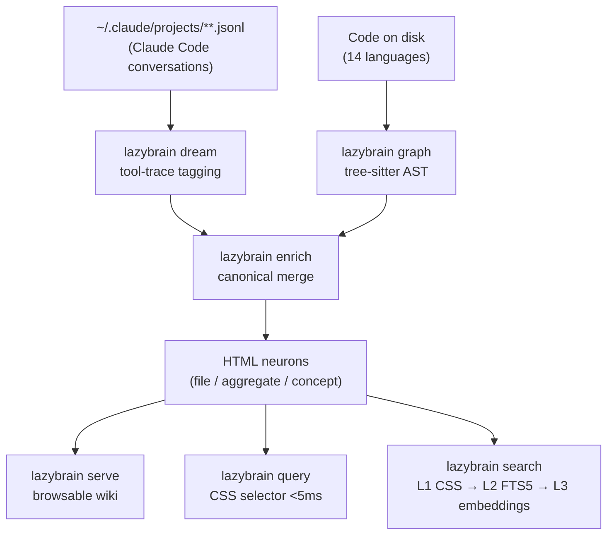

# LazyBrain

**Your code and your AI conversations, fused into a single queryable brain.**

One HTML page per source file. Fed by the decisions, bugs, and ideas from every conversation that touched it. Retrieved by CSS selector in &lt;5 ms. Runs locally, costs nothing to query.

[](./LICENSE)
[](https://nodejs.org)
[](#key-properties)
[](#zero-query-cost)
[](./scripts/bench-determinism.mjs)

> **Read the thesis:** [Why HTML beats Markdown for an LLM's memory — a data-backed case](./docs/why-html-for-ai-memory.html)
> A self-contained, self-demonstrating HTML page. Live CSS query demo included.

---

## Why LazyBrain

Two kinds of knowledge pile up every day and disappear:

1. **Code knowledge** — what each file does, what it imports, every design decision baked into it.
2. **Conversation knowledge** — the decisions, bug fixes, and ideas you and your AI agent produced about that code.

Markdown note systems can store text but cannot return *just the relevant section* of *just the relevant file*. They dump whole documents at the LLM. Vector DBs fix that but cost an LLM call per query and return approximate results.

LazyBrain stores everything as **HTML with `data-cerveau-*` attributes**, so retrieval is a CSS selector: surgical, deterministic, and free.

---

## The HTML Advantage

### Token-efficient retrieval — surgical strip beats Markdown at equal recall

Measured on the bundled `examples/sample-brain` (53 neurons, 5 developer queries, `tiktoken cl100k_base`).
Reproduce: `node scripts/run-benchmark.mjs` — runs on the bundled examples/sample-brain — no setup, no private data.

| Format | Avg tokens / query | Avg recall | Avg tokens / correct result | Notes |
|---|---|---|---|---|
| Raw `~/.claude/projects` JSONL scan | 7,461 | 0% | null (0 hits) | |
| HTML-generic (whole files, raw markup) | 1,087 | 80% | 544 | |
| Markdown whole-note (Obsidian-style) | 435 | 80% | 205 | |
| **LazyBrain `search --strip` (surgical)** | **254** | **80%** | **119** | **← this is how the product retrieves** |
| HTML-LB full-neuron (whole knowledge text) | 380 | 80% | 190 | Equal-coverage comparison only — NOT how the product retrieves (see note below) |

**The headline: LazyBrain surgical strip returns only the relevant section — ~254t avg vs ~435t for Markdown whole-note at equal recall (80%). 1.7x fewer tokens, no recall tradeoff.**

> **Note on the full-neuron row:** `HTML-LB full-neuron` returns the complete knowledge text of every matched neuron — all sections, not just the relevant one. This row exists for an honest equal-coverage comparison only. It is **not** how LazyBrain retrieves in practice. On the small bundled sample-brain, full-neuron can use more tokens than Markdown because it returns whole neurons; the actual product always uses the surgical strip above (`lazybrain search --strip`), which wins on tokens at equal recall.

1. **Surgical strip (254t, 80% recall):** 1.7x fewer tokens than Markdown at identical recall. `lazybrain search --strip` returns only the query-matched sections — not the whole file. No recall tradeoff.
2. **Structural queries:** `data-cerveau-type="decision"` returns only decisions — 100% precision by construction. Markdown cannot express this query.
3. **Deterministic, $0:** ~1ms L1 latency, no LLM, no server. Byte-identical across runs.

Full methodology, honest caveats, and reproduction instructions: [docs/BENCHMARKS.md](./docs/BENCHMARKS.md).

Deep dive: [Why HTML is the right format for an LLM second brain →](./docs/WHY-HTML.md)

### Exact typed retrieval — record precision on structural queries

Every fact in the brain is an HTML element with `data-cerveau-*` attributes. A query like:

```css
article[data-cerveau-type="decision"]:not([data-cerveau-valid-until])
```

returns **exactly** the still-valid decisions — zero false positives, by construction. A CSS predicate cannot return a non-matching element. Markdown cannot express these filters at all.

```css
/* Active decisions only */
article[data-cerveau-type="concept"]:not([data-cerveau-valid-until])

/* Bugs in one project */
article[data-cerveau-tags~="bug"][data-cerveau-topic~="acme"]

/* Decisions made this month */
article[data-cerveau-type="concept"][data-cerveau-created>="2026-05-01"]
```

Honest note: LazyBrain has not been evaluated on LoCoMo, LongMemEval, or DMR. Precision claims above apply to typed/structural queries — not to open-domain QA benchmarks.

### Zero query cost, ~100x faster, deterministic

L1 CSS retrieval runs in ~2–8 ms, costs $0, requires no LLM, no embeddings, no running server. Output is byte-identical every run.

| System | Query latency | LLM required | Cost per query |
|---|---|---|---|
| mem0 | p50 0.71 s / p95 1.44 s | YES | ~$0.001–0.01 |
| Zep/Graphiti e2e | 2.6–3.2 s | YES | cloud API + Neo4j |
| **LazyBrain L1** | **~2–8 ms** | **NO** | **$0** |
| **LazyBrain L2 (FTS5)** | **~50–200 ms** | **NO** | **$0** |
| **LazyBrain L3 (embeddings)** | **<1 s** | **NO** | **$0** |

Verify determinism yourself:

```bash
node scripts/bench-determinism.mjs --brain /your/brain
# PASS — all 10 runs returned byte-identical results.
```

### A navigable brain

`lazybrain serve` opens a browsable wiki at `http://127.0.0.1:4242`. The knowledge graph is organized as project → module → file → decisions. Every page has backlinks. It is a second brain you can actually read.

### A shareable brain

The brain is plain HTML files on disk. Zip it, commit it to git, send it to a teammate. No app, no database, no server required to read it.

### A hostable brain

Because it is static HTML, you can publish your brain as a website — GitHub Pages, Netlify, any static host. Your second brain becomes a public, searchable site.

---

## Code and Conversations, Fused

LazyBrain creates one HTML page per source file, built from a tree-sitter AST (14 languages), then enriches it with the decisions, bugs, and ideas from every conversation that edited that file. The link is exact: it uses the `file_path` of the agent's `Edit`/`Write` tool calls as a 100%-reliable attribution signal.

The result is a neuron that knows both *what the code does* and *why it was written that way*.

This fusion is unique. Code-graph tools cover code only. Markdown tools (Obsidian, basic-memory) cover notes only. No other tool bridges both.

Three neuron types, all HTML, all linked:

- **file-neuron** — one page per source file. Classes and functions are in-page anchors (`#fn-name`). Sections: infobox, imports/exports, functions defined, callers, and — once enriched — decisions/bugs/ideas from conversations that edited it.
- **aggregate-neuron** — one page per directory and per project, linking down to its children. The navigation backbone.
- **concept-neuron** — a decision or idea that spans multiple files (e.g. "we chose Stripe over X"), linked to every neuron it relates to.

---

## How It Compares

| | Obsidian | mem0 | Zep/Graphiti | cognee | Letta | khoj | **LazyBrain** |
|---|---|---|---|---|---|---|---|
| Input: source code (AST) | plugin only | NO | NO | NO | NO | NO | **YES (14 langs)** |
| Input: AI conversation history | NO | partial | YES | NO | YES | NO | **YES (tool-trace)** |
| Code + conversation fusion | NO | NO | NO | NO | NO | NO | **YES (unique)** |
| Storage: plain files on disk | YES (Markdown) | NO | NO (graph DB) | NO | NO | partial | **YES (HTML)** |
| CSS structural queries (&lt;5 ms, $0) | plugin only | NO | NO | NO | NO | NO | **YES** |
| Typed / temporal attributes | plugin only | partial | YES | NO | NO | NO | **YES (bi-temporal)** |
| LLM call required to query | NO | YES | YES | YES | YES | partial | **NO** |
| Deterministic output | YES | NO | NO | NO | NO | NO | **YES** |
| Requires external DB | NO | YES | YES (Neo4j) | YES | YES | YES | **NO** |
| Local-first | YES | partial | partial | YES | partial | YES | **YES** |

Where LazyBrain leads: lowest surgical token cost (~254t avg, $0) via `search --strip` which returns only the relevant section — 1.7x fewer tokens than Markdown whole-note at equal recall (254t vs 435t), lowest latency (~1ms L1 on sample brain), zero LLM to retrieve, byte-reproducible outputs, exact typed/temporal filtering (100% precision by construction), no external DB, unique code+conversation fusion.

Where it lags: no published accuracy numbers on LoCoMo / LongMemEval / DMR; multi-hop synthesis depends on the LLM consuming the retrieved context; pre-launch vs 17k–57k stars for competitors; no ingestion of PDFs or web pages yet.

Full evidence-based matrix with citations: [docs/COMPARISON-vs-second-brains.md](./docs/COMPARISON-vs-second-brains.md).

---

## Pipeline



---

## Install

```bash
git clone https://github.com/LazyGod75/LazyBrain.git
cd LazyBrain
npm install && npm run build && npm link
```

Requirements: Node >= 20, git. Hooks require a POSIX shell (Git Bash or WSL on Windows, or the built-in Node dispatcher).

New here? See the [5-minute Getting Started guide](./docs/GETTING-STARTED.md).

---

## Quick Start

```bash
# 1. Initialize a brain in the current directory
lazybrain init

# 2. Point commands at it (or rely on auto-discovery)
export LAZYBRAIN_BRAIN_PATH="$PWD/.lazybrain/brain"

# 3. Build — code-first pipeline
lazybrain dream --pretty        # conversations → notes (tool-trace). Deterministic, $0, no LLM
lazybrain index-rebuild         # build the SQLite FTS5 index
lazybrain graph --pretty        # scan code → file/module/project neurons + import edges
lazybrain enrich --pretty       # wire conversation knowledge onto file-neurons + concepts
lazybrain index-rebuild         # re-index the enriched brain

# 4. Use it
lazybrain serve                 # browse the wiki at http://127.0.0.1:4242
lazybrain search "auth bugs" --top 5
lazybrain query 'article[data-cerveau-type="decision"]:not([data-cerveau-valid-until])'
```

First run scans all your conversations and code. Timing: &lt;50 conversations (seconds), 500+ (5–10 min), 3000+ (10–20 min). After that, runs are incremental — SHA-256 fingerprints skip everything unchanged, so a daily re-run takes seconds.

### Inside Claude Code

| Skill | Purpose |
|---|---|
| `/lazybrain-dream-init` | One-time bootstrap from all past conversations |
| `/lazybrain-graph` | Scan code and conversations, build the graph |
| `/lazybrain-understand` | Create knowledge-node HTML files |
| `/lazybrain-search` | Full-text and semantic search |
| `/lazybrain-query` | Deterministic CSS-selector query (&lt;5 ms) |
| `/lazybrain-recall` | Pull specific sections of prior work |
| `/lazybrain-summary` | Brain stats and overview |
| `/lazybrain-time-travel` | Reconstruct brain state at a past date |

---

## Retrieval Levels

| Level | Mechanism | Typical latency | Cost |
|---|---|---|---|
| L1 | CSS selector over HTML attributes | &lt;5 ms | $0 |
| L2 | SQLite FTS5 (BM25 + structural-field boost) | ~50–200 ms | $0 |
| L3 | Local ONNX embeddings (bge-base), cached in SQLite | &lt;1 s | $0 |

A natural-language keyword query routes to L2 and returns in ~0.6 s on a ~7,000-note brain — zero LLM calls, zero network. Embeddings are precomputed and cached; queries never reload the model. HyDE / LLM query-expansion is opt-in via `LAZYBRAIN_HYDE=1`.

---

## Key Properties

- **Generic / zero-config.** No hardcoded paths. Brain path resolves: `--brain` flag → `LAZYBRAIN_BRAIN_PATH` → walk-up to a `.lazybrain/` marker → `~/.lazybrain/brain` fallback.
- **Local and private.** Tree-sitter is local WASM. FTS5 and embeddings are local. `serve` binds `127.0.0.1` only. Zero outbound network calls by default.
- **Incremental.** SHA-256 + mtime fingerprints — only changed conversations and files are reprocessed.
- **Recency = truth.** Newer claims supersede older ones on the same neuron (`data-cerveau-valid-until`). Past state is recoverable via `lazybrain time-travel`.
- **Noise-aware.** Repetitive agent-log notes are auto-purged so search stays clean.

---

## Documentation

| Document | Purpose |
|----------|---------|
| [docs/GETTING-STARTED.md](./docs/GETTING-STARTED.md) | 5-minute walkthrough: install, first brain, first query |
| [docs/WHY-HTML.md](./docs/WHY-HTML.md) | Technical case for HTML as the LLM second-brain format |
| [docs/why-html-for-ai-memory.html](./docs/why-html-for-ai-memory.html) | Blog post / thesis — self-contained HTML with live CSS demo |
| [docs/BENCHMARKS.md](./docs/BENCHMARKS.md) | Full benchmark methodology, results, and honest caveats |
| [docs/COMPARISON-vs-second-brains.md](./docs/COMPARISON-vs-second-brains.md) | Evidence-based comparison against Obsidian, mem0, Zep, cognee, and others |

---

## Contributing

```bash
npm run typecheck   # 0 errors
npm run lint
npm test            # full suite
```

Issues, benchmark results from your own brain, and PRs are welcome.

---

## License

Apache 2.0 — see [LICENSE](./LICENSE).
